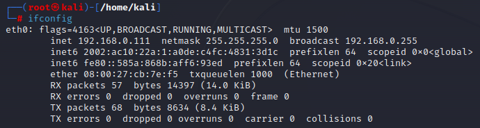
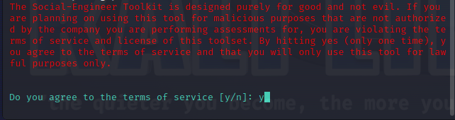
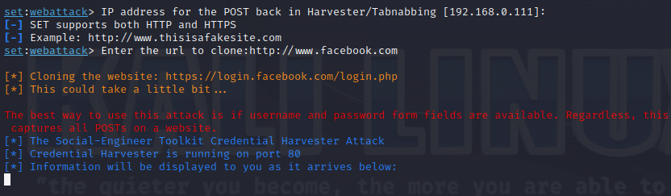
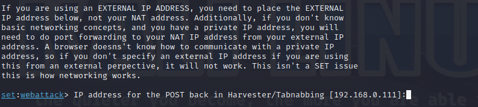
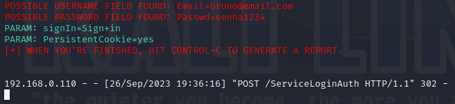

# Phishing para captura de senhas do Facebook

### Ferramentas necessárias

- Máquina Virtual com Kali Linux
- Ferramenta setoolkit via terminal

### Configurando o Phishing no Kali Linux

- Para iniciar vamos abrir o terminal >> Teclas Ctrl + Alt + T
- Dar permissão de acesso como root: ``` sudo su ```
- Obtendo o endereço da nossa máquina: ``` ifconfig ```
 
- Por padrão a senha do usuário root é "kali".
- Iniciando o setoolkit: ``` setoolkit ```
 
- Concordamos com os Termos de serviço digitando ``` y ```
- Obs: Para escolher as opções digitamos o número da opção desejada.
- Tipo de ataque - Escolher a Opção 1: ``` Social-Engineering Attacks ```
- Vetor de ataque - Escolher a Opção 2: ``` Web Site Attack Vectors ```
- Método de ataque - Escolher a Opção 3: ```Credential Harvester Attack Method ```
- Método de ataque - Escolher a Opção 2: ``` Site Cloner ```
- Agora na hora de inserir o endereço para requisições POST, vamos colocar o Ip da nossa máquina Kali Linux, para isso verifique com “ifconfig” em “inet address”
- Vamos prosseguir apenas dando um enter, não é necessário digitar se vamos subir um servidor web localmente.
- Agora vamos informar a URL a ser clonada: http://www.facebook.com
 
- Depois de informada a URL a ser clonada o SETOOLKIT já iniciará o nosso servidor web, com as páginas html clonadas e inicializadas.
 
- Após vamos acessar a nossa web page clonada pelo endereço ip, acessando pela guia anonima.
- Vamos inserir algumas credenciais de teste para verificar se nosso ataque está funcionando

- Será mostrado na resposta da requisição do nosso servidor web, as credenciais capturadas
- E a página em nosso navegador será redirecionada para a página real do facebook.

### Resutados


